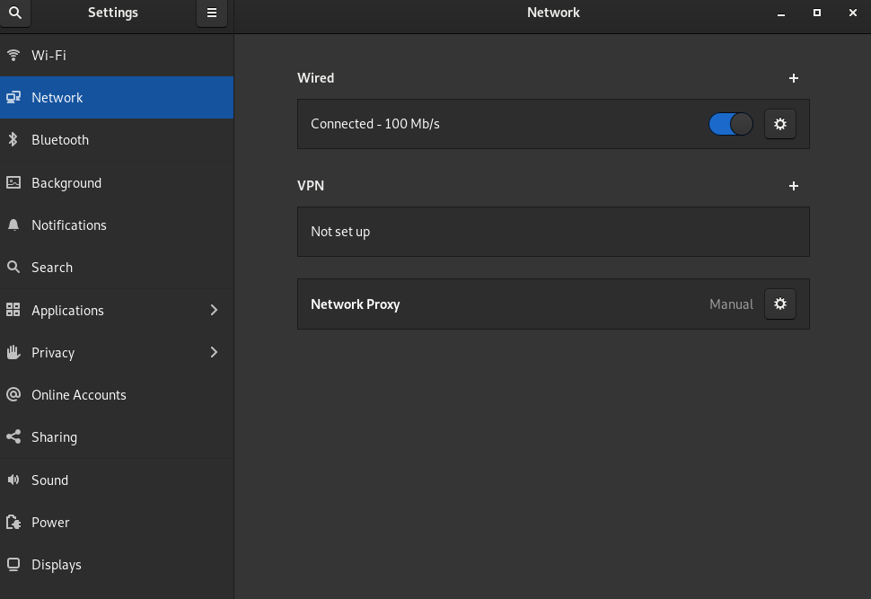

# Proxy Revamped

The main aim of this enhanced python script is to overcome the limitations on the usage of the LAN connection through the terminal on Linux machines.

## Changes made in this version:

A single file is created at the path `/etc/environment`.
It contains the proxy information and is system-wide for the user.

## Additional changes that may be needed

Installation of snap applications may require additional commands. They are as follows:
```
sudo snap set system proxy.http=$http_proxy
sudo snap set system proxy.https=$http_proxy
```

To unset the snap proxy, use the following commands:
```
sudo snap unset system proxy.http
sudo snap unset system proxy.https
```

## To see the changes in effect:

- Turning ON the proxy:
    - Setup your proxy from the Network menu.
    - Go to Network Proxy menu and turn it to **`Manual`**
    
    - Installation of snap applications may require additional commands. They are as follows:
        ```
        sudo snap set system proxy.http=$http_proxy
        sudo snap set system proxy.https=$http_proxy
        ```
    > Open a new terminal instance.

- Turning OFF the proxy:
    - Go to Network Proxy menu and turn it to **`Disabled`**
    - To unset the snap proxy, use the following commands:
        ```
        sudo snap unset system proxy.http
        sudo snap unset system proxy.https
        ```
    > Open a new terminal instance.
